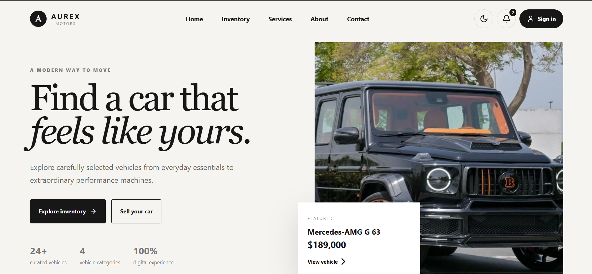

# AUREX MOTORS

### Modern Automotive Marketplace

AUREX MOTORS is a modern automotive marketplace designed to make vehicle discovery simple, intuitive, and engaging.

The project combines a premium automotive interface with practical marketplace features such as vehicle search, filtering, favorites, comparison, user accounts, and a digital vehicle-selling experience.

Built as a portfolio project, AUREX MOTORS demonstrates frontend development, responsive UI design, interactive application logic, and product-focused thinking.

---

## Overview

Finding the right vehicle can involve searching through large amounts of information across different platforms.

AUREX MOTORS explores a cleaner approach: bringing vehicle discovery, comparison, and user interactions into one focused digital experience.

The interface is designed around three principles:

* **Clarity** — important vehicle information is easy to discover.
* **Simplicity** — common actions require minimal steps.
* **Premium experience** — the visual design reflects the automotive industry.

---

## Key Features

### Vehicle Discovery

* Browse a curated multi-category vehicle inventory
* Search vehicles by make, model, body type, fuel type, and other attributes
* Filter vehicles by category and price
* Sort vehicles by price and mileage

### Vehicle Details

* Detailed vehicle information
* Specifications including engine, power, drivetrain, and mileage
* Dedicated vehicle detail interface
* Featured vehicle presentation

### Personalization

* Save vehicles to favorites
* Compare up to three vehicles
* Persistent favorites using browser local storage
* User profile and account interface
* Account settings and notification preferences

### User Experience

* Responsive desktop, tablet, and mobile layouts
* Light and dark appearance modes
* Interactive modals
* Smooth navigation and transitions
* Mobile-friendly navigation
* Feedback and notification states

### Seller Experience

* Sell Your Car interface
* Vehicle information submission
* Seller contact information
* Vehicle details and description fields
* Photo upload interface

---

## Technology Stack

| Technology        | Purpose                                     |
| ----------------- | ------------------------------------------- |
| **React**         | Frontend application and component-based UI |
| **JavaScript**    | Application logic and interactivity         |
| **Vite**          | Development environment and build tooling   |
| **CSS**           | Responsive styling and visual design        |
| **Lucide React**  | Interface icons                             |
| **Local Storage** | Persistent client-side user preferences     |

---

## Application Structure

```text
aurex-motors/
│
├── src/
│   ├── App.jsx          # Main application and UI logic
│   ├── data.js          # Vehicle inventory data
│   ├── main.jsx         # React application entry point
│   └── styles.css       # Global styling and responsive design
│
├── index.html           # Application entry point
├── package.json         # Dependencies and scripts
└── README.md            # Project documentation
```

---

## Getting Started

### Prerequisites

Make sure you have:

* Node.js installed
* npm installed
* Git installed

### Installation

Clone the repository:

```bash
git clone https://github.com/ozmayousufzai/Aurex-motors.git
```

Navigate to the project:

```bash
cd aurex-motors
```

Install dependencies:

```bash
npm install
```

Start the development server:

```bash
npm run dev
```

Open the local URL provided by Vite in your browser.

---

## Design & Development Focus

AUREX MOTORS was developed with an emphasis on building a realistic product rather than only creating a static landing page.

The project focuses on:

* Component-based React development
* State management with React hooks
* Interactive UI patterns
* Responsive design
* Client-side persistence
* Search and filtering logic
* Reusable interface components
* Accessibility-conscious interaction areas
* Product-oriented user flows

---

## Future Development

The current project focuses primarily on the frontend experience. Future versions could introduce a production backend and additional marketplace functionality, including:

* Secure authentication
* PostgreSQL or Supabase database
* Real vehicle inventory APIs
* Admin dashboard
* Cloud image storage
* Saved searches
* Price-drop notifications
* Test-drive booking
* Vehicle reservations
* Payment integration
* Multilingual support
* Personalized vehicle recommendations
* Dealership location and map integration

---

## Project Status

**Active portfolio project**

The frontend experience is functional and continues to be refined with additional marketplace features, visual improvements, and production-oriented functionality.

---
## Preview




## Live Demo

**Coming soon**

---

## Developer

Designed and developed as a portfolio project to demonstrate modern frontend development, responsive UI/UX design, and practical product development skills.

---

### AUREX MOTORS

**Premium vehicles. Transparent choices. Better journeys.**
